# Structure-from-Motion (SfM) Project Report


This report presents the implementation of an incremental Structure-from-Motion (SfM) pipeline to reconstruct 3D geometry from a set of 2D images. Focusing on a progressive approach, the system starts with an initial stereo reconstruction and incrementally adds new views by estimating camera poses and triangulating new 3D points. The Middlebury Temple Ring dataset—comprising 46 pre-calibrated images—was used as the primary benchmark, a custom dataset of a house model was used with 68 images followed by the camera calibration and Lund university dataset of Park Gate of 34 images was used. Core components of the pipeline include feature extraction using SIFT, robust matching with Lowe’s ratio test and RANSAC-based fundamental matrix estimation, camera pose estimation via Perspective-n-Point (PnP), and bundle adjustment for global optimization. Optional colorization of the reconstructed point cloud was also implemented to enhance visual realism. The final model achieved a high-accuracy reconstruction with a mean reprojection error reduced from 2.5 to 0.72 pixels after bundle adjustment, yielding a sparse point cloud of 7,588 points. Visual results, evaluation metrics, and analysis are provided to validate the effectiveness of the pipeline and highlight areas for future enhancement.

## How to Run the Code 


This guide explains how to set up and run the code for **Incremental Structure from Motion (SfM)** to reconstruct a 3D point cloud from 2D images.

---

## Prerequisites

Make sure you have **Python 3.10+** and **Conda** installed. If using your own image dataset, ensure you have checkerboard images for camera calibration.

---

## Environment Setup

### 1. Create a Conda Environment

```bash
conda create -n sfm_env python=3.10
conda activate sfm_env
```

A conda environment export is also uploaded

### 2. Install Dependencies

Install the required Python packages:

```bash
conda install numpy opencv conda-forge::open3d matplotlib scipy imageio tqdm
```

## Project Structure
``` bash 

project/
├── datasets/                   # Input datasets
│   ├── House/
│   └── templeRing/
├   └── Park_Gate/
├── cal1/                       # Checker Board images for Camera calibration 
│── camera calibration.ipynb
├── matching.py                  # Core Structure-from-Motion modules
│──  reconstruction.py
├── bundle_adjustment.py
├── utils.py
├── visualize_sfm.py
├── main.ipynb                    # Main Notebook for SFM 
├── Image_tools.ipynb             # For Preprocessing custom data
├── outputs/                      # Generated outputs
├── results/                      
├── environment_minimal.yml       # Conda environment setup 
└── Readme.md                     # Main project overview

```


## Run the Full Pipeline

You can run the pipeline using Jupyter Notebook:

```bash
jupyter notebook main.ipynb

```
Or convert and run it as a Python script:

```bash
jupyter nbconvert --to script main.ipynb --output run_pipeline
python run_pipeline.py
```
This will perform the following:

- Load image datasets
- Perform camera calibration (if enabled)
- Extract and match features
- Reconstruct 3D structure
- Optimize using bundle adjustment
- Save visualizations and outputs to /outputs

## Runing of Different Datasets

To run the SFM pipeline on different datasets: "Temple Ring, House and Park Gate" change the dataset_path in the main jupyter notebook cell under the Configuration & Setup cell 

```
dataset_path = './templering'
valid_extensions = ['.jpg', '.jpeg', '.png', '.bmp', '.tiff']
ext = rename_images_sequentially(dataset_path, valid_extensions=valid_extensions)

```
---

### Results

**Temple Ring**

Pointcloud of temple ring: 

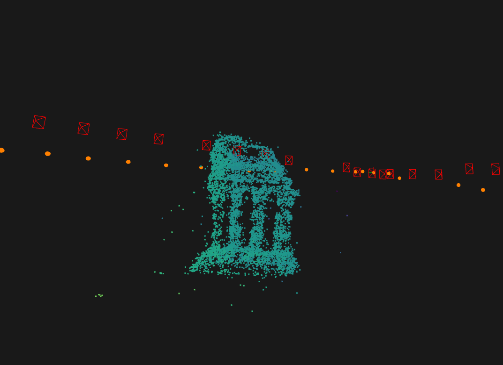
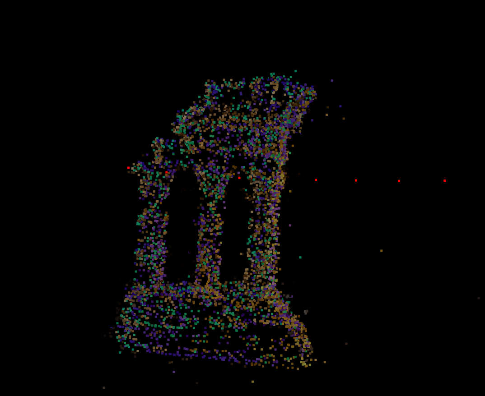
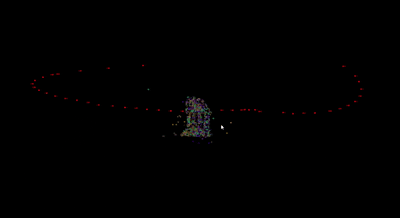

Camera poses and trajectories for temple ring: 

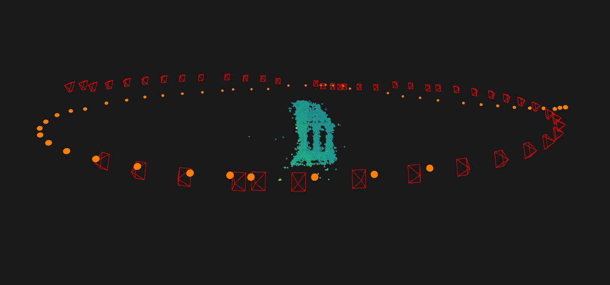

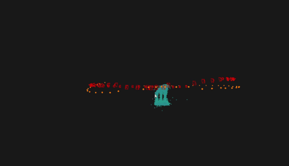

**House Dataset**

Pointcloud of house: 

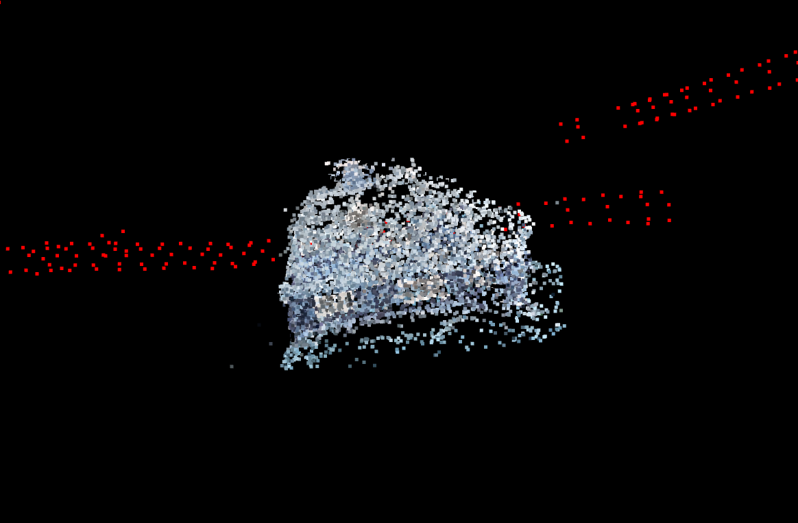

Camera poses and trajectories for house: 

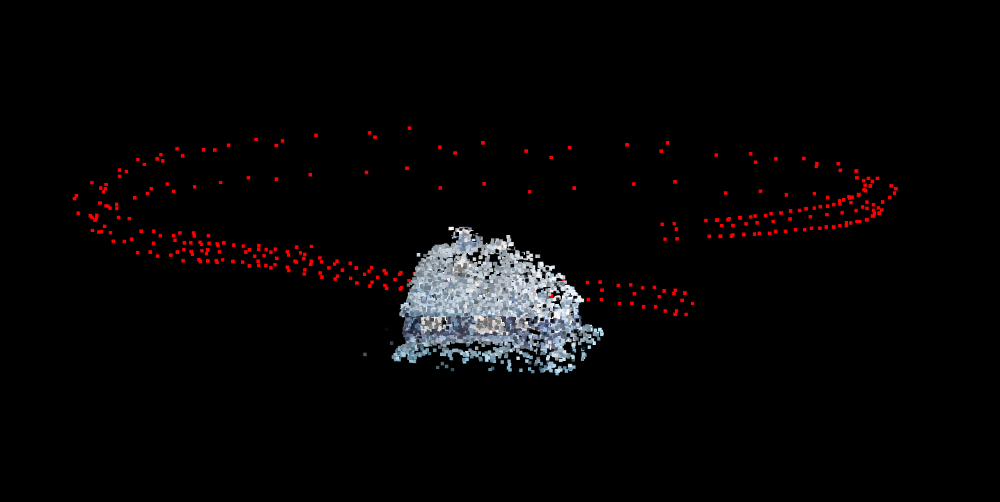

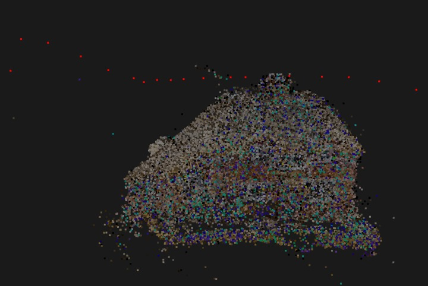

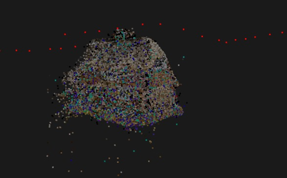

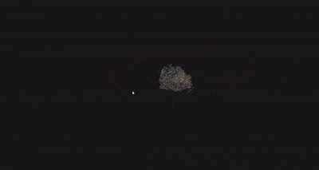

**Gate Dataset**

Pointcloud of Gate: 

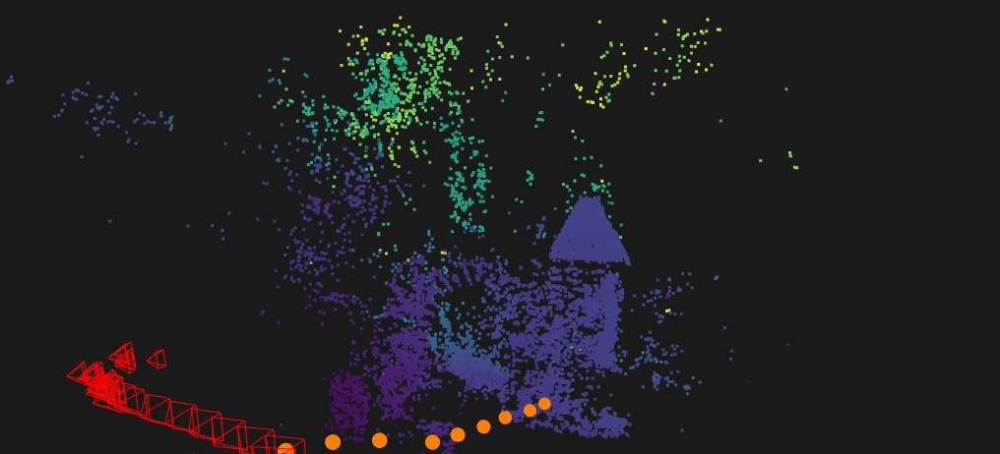


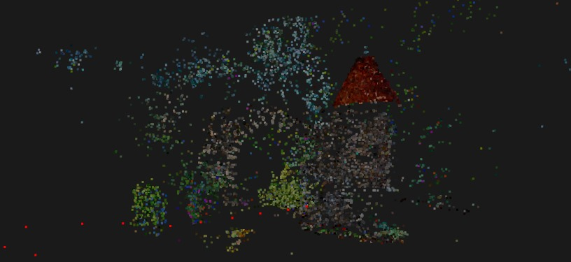


**TempleRing**
```bash
INFO:SFM:============================================================
INFO:SFM: Structure from Motion Summary
INFO:SFM:============================================================
INFO:SFM: Images used             : 46 / 46
INFO:SFM: Final 3D points         : 7387
INFO:SFM: Avg reprojection error : 0.66 pixels
INFO:SFM: Avg 3D pts per image   : 160.59
INFO:SFM:============================================================
```
**House Dataset**
```bash
INFO:SFM:============================================================
INFO:SFM: Structure from Motion Summary
INFO:SFM:============================================================
INFO:SFM: Images used             : 68 / 68
INFO:SFM: Final 3D points         : 54074
INFO:SFM: Avg reprojection error : 0.94 pixels
INFO:SFM: Avg 3D pts per image   : 795.21
INFO:SFM:============================================================

```
**Park Gate**
```bash
INFO:SFM:============================================================
INFO:SFM: Structure from Motion Summary
INFO:SFM:============================================================
INFO:SFM: Images used             : 34 / 34
INFO:SFM: Final 3D points         : 14086
INFO:SFM: Avg reprojection error : 1.76 pixels
INFO:SFM: Avg 3D pts per image   : 414.29
INFO:SFM:============================================================

```


### Future Improvements  
1. **Loop Closure**: Integrate g2o/Ceres for global BA with loop detection.  
2. **Scale Correction**: Use IMU data or semantic priors to resolve scale drift.  
3. **Multi-Scale Processing**: Add image pyramids for better handling of large baselines.  
4. **Real-Time Visualization**: Optimize rendering for large-scale scenes.  

---

## Citation

If you use this code or find it helpful, please cite the following paper:

```bibtex
@article{zeeshan2025incrementalSfM,
  title={3D Reconstruction via Incremental Structure From Motion},
  author={Muhammad Zeeshan and Umer Zaki and Syed Ahmed Pasha and Zaar Khizar},
  journal={arXiv preprint arXiv:2508.01019},
  year={2025},
  url={https://arxiv.org/abs/2508.01019}
}
```

This paper was accepted at [IBCAST 2025](https://www.ibcast.org.pk/).

## References  
1. OpenCV Documentation: https://docs.opencv.org/   
2. Hartley, Zisserman. *Multiple View Geometry in Computer Vision*.  
3. Scipy Optimization: https://docs.scipy.org/doc/scipy/reference/optimize.html   
4. Open3D: http://www.open3d.org/docs/  
5. This implementation is based on multiple computer vision and structure from motion techniques. The datasets, Temple Ring is from the Middlebury Multi-View Stereo dataset. https://vision.middlebury.edu/mview/data/ and Park Gate dataset is taken from https://www.maths.lth.se/matematiklth/personal/calle/dataset/dataset.html
